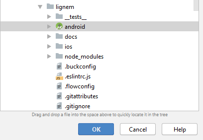
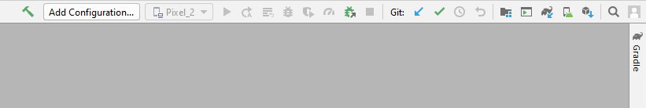
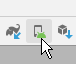
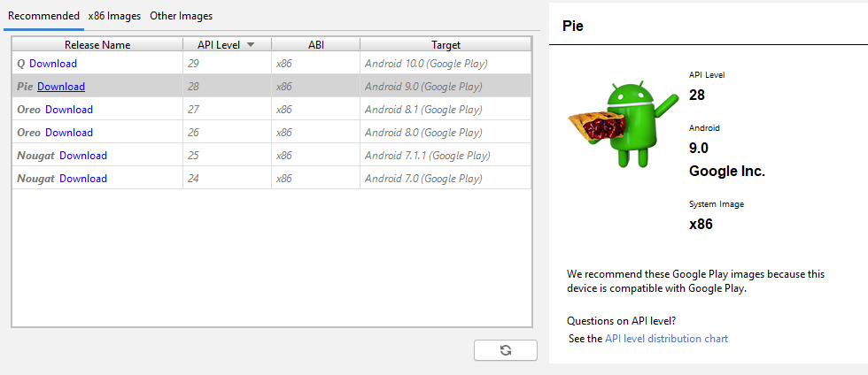
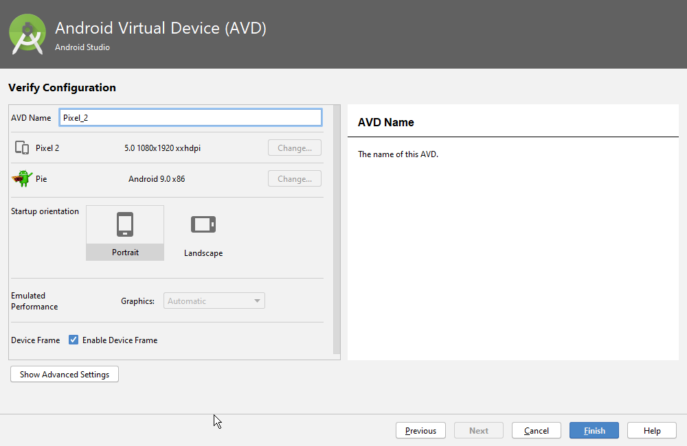
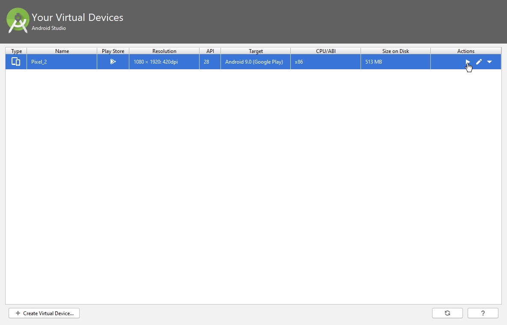

# Preparando ambiente para desenvolvimento (com emulador)

Para testar e rodar o app em um emulador Android (possível em Windows/Linux/Mac OS), siga os seguintes passos.

**Observação:** Esse tutorial ensina a instalar emuladores do Android Studio, que são mais performáticos que outros, porém também são mais pesados. Além disso, este tutorial também focará mais no Windows, já que as partes de usar terminal são mais fáceis em Linux ou Mac OS.

## Instalando o Android Studio

Essa parte, obviamente a mais fácil (_não que o resto seja difícil_) consiste apenas em instalar o Android Studio. Você pode baixá-lo [neste link](https://developer.android.com/studio/) ou por algo da JetBrains (o site ou o ToolBox). A JetBrains dá todos produtos gratuitos para estudantes.

## Abrindo o projeto

Depois de instalar o Android Studio, selecione a opção de _abrir um projeto_ e selecione a pasta android no seguinte caminho (recomendado)

## Abrindo o _AVD Manager_

Ao abrir a IDE, você verá uma barra de ferramentas na parte superior, que deve se parecer com isso

Então, clique nesse botão - o botão _AVD manager_

Ao abrir a janela então, clique no botão mais óbvio possível, _create virtual device_

## Criando um _AVD_

A janela de criação de um AVD é bem intuitiva, mas muito provavelmente você terá que baixar uma versão android, então só clique em download na linha do android desejado e instale normalmente, seguindo as instruções da própria página.

**No meu caso, criei um dispositivo Pixel 2 com o nome Pixel_2**

**Observação:** Também tem como criar um AVD pela linha de comando, porém a interface ajuda muito o processo

## Iniciando um _AVD_

Existem 2 métodos para se iniciar um _AVD_

### Método 1: Android Studio

Iniciar um _AVD_ pelo Android Studio é muito simples, basta entrar no projeto, abrir o _AVD Manager_ e rodar o emulador clicando no botão (sim, esse mesmo, o mais óbvio)

### Método 2: Linha de comando

Para as pessoas menos psicopatas, temos o segundo método, que consiste em rodar o _"executável"_ do emulador no local desejado.

**Observação:** Esse método não precisa de ter o Android Studio aberto, por isso é o melhor.

Este arquivo se encontra (por padrão, no Windows) na pasta `C:\Users\{user}\AppData\Local\Android\Sdk\emulator`

O arquivo se chama `emulator.exe`, assim, você pode executá-lo de duas maneiras

---

#### Pelo caminho completo

Esse é o mais simples e o mais trabalhoso ao mesmo tempo, já que pra executar o programa você precisa o caminho inteiro, algo parecido com isso:

`C:\Users\{user}\AppData\Local\Android\Sdk\emulator\emulator.exe {parametros}`

#### Adicionando o caminho da pasta em nas variáveis de ambiente do Windows

Esse requer uma configuração bem rápida a mais, porém é o recomendado _por motivos óbvios_

1. Pesquise por _"PATH"_ na barra de pesquisas do Windows e clique na primeira opção, _"Editar as variáveis de ambiente do sistema"_

2. Abra a janela e clique em _"variáveis de ambiente"_, na parte inferior

3. Em variáveis do sistema, abra a variável _Path_

4. Clique no botão _novo_ e adicione o caminho **para a pasta**, não coloque o executável no final do caminho, apenas da pasta dele

5. Clique em OK, Aplicar, OK...

Assim, para executar o arquivo, basta escrever `emulator {parametros}`

---

De qualquer uma das formas, você terá que estar dentro da pasta do projeto e colocar alguns paramêtros para executar, ou seja, ficará assim

`emulator -avd nome_do_avd`

No meu caso, então

`emulator -avd Pixel_2`

## Executando o projeto

Como todos já sabem, depois de ter o emulador aberto e rodando, basta rodar (em outro cmd/terminal) o comando react-native run-android dentro da pasta do projeto

Depois disso, só começar a _codar_ **_@iagod_**
